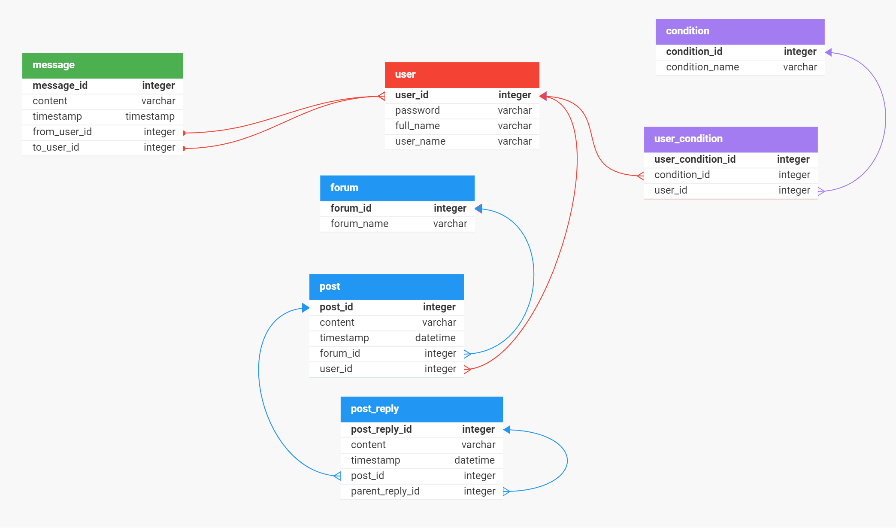

# How to use the server
**To run**:
`uvicorn main:app --reload`

## Accessing endpoints
All endpoints can be viewed and tested by
starting the server and heading [here](127.0.0.1:8000/docs#).

## Database
The following schema is used:
